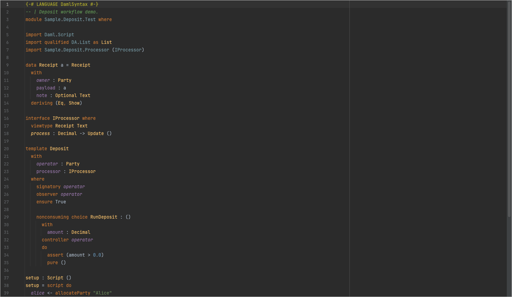
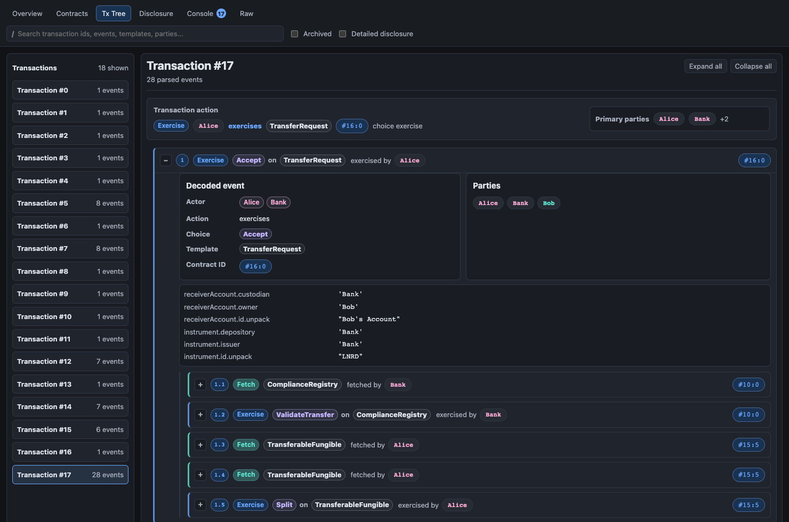
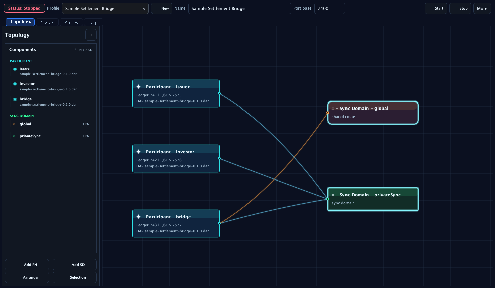
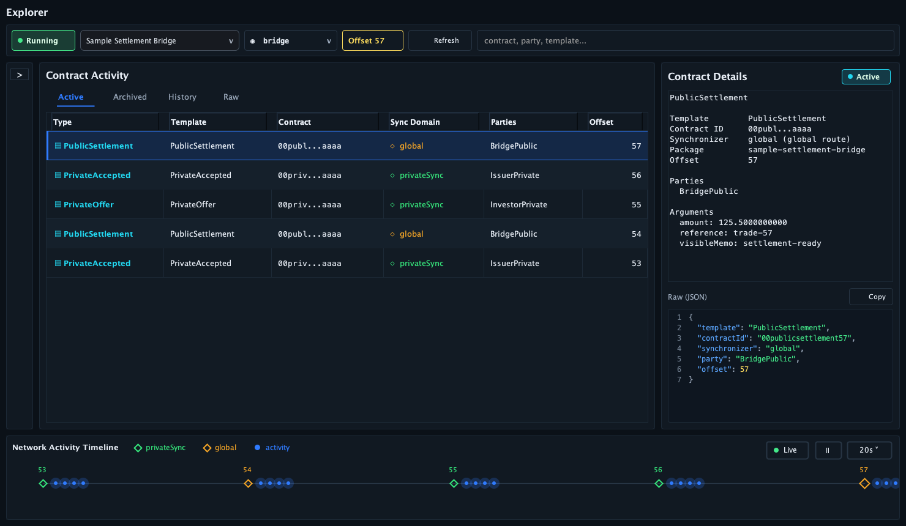

# DAML for JetBrains

Write, run, and inspect DAML applications and local Canton networks without leaving your JetBrains IDE.

## What it does

- Edit DAML with highlighting, diagnostics, completion, navigation, symbols, and rename.
- Run DAML builds, tests, scripts, and local Canton nodes.
- Inspect script results, contracts, transactions, ledger activity, and participant endpoints.
- Install DPM and DAML SDKs, then configure projects and multi-participant Canton networks inside the IDE.

## Quick start

Requires a JetBrains IDE based on IntelliJ Platform 2026.1 or newer and JDK 21. Install Canton to use local network tools.

1. Build the plugin:

   ```bash
   ./gradlew buildPlugin
   ```

2. Open **Settings / Preferences -> Plugins -> Gear -> Install Plugin from Disk...** and select `build/distributions/daml-canton-jetbrains-<version>.zip`.
3. Open a DAML project, then install DPM and the required DAML SDK under **Settings -> Languages & Frameworks -> DAML**.

## Feature tour

### Write DAML

Highlight, complete, navigate, and refactor `.daml` files.



### Inspect script results

Run a `Script` from the gutter and inspect its contracts and transaction tree. This capture uses the real [`testTransferWithSplit`](https://github.com/Moonsong-Labs/canton-apps/blob/ca0ede4441af0b93c653235c2c035f5bde6a77d8/lunar-dollar/daml/Tests/Tests.daml#L34-L56) flow.



### Run local Canton networks

Create multi-participant profiles, assign DARs and parties, connect sync domains, and inspect the topology.



### Explore ledger activity

Inspect contracts, transactions, parties, synchronizers, raw JSON, and participant activity.


